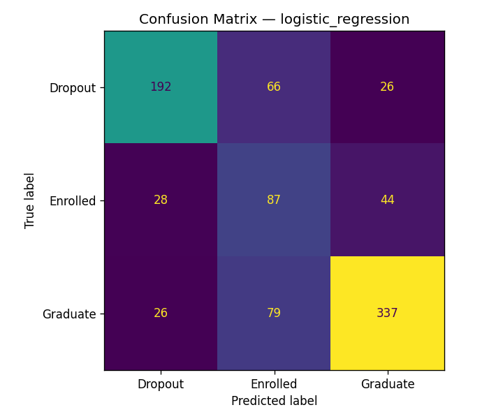
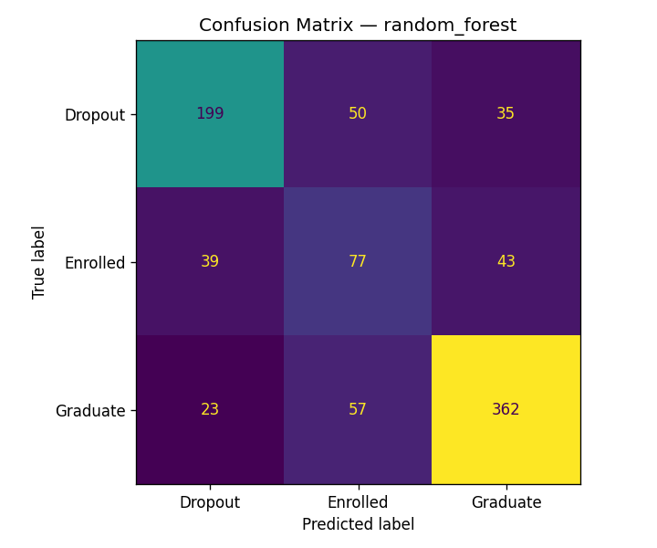
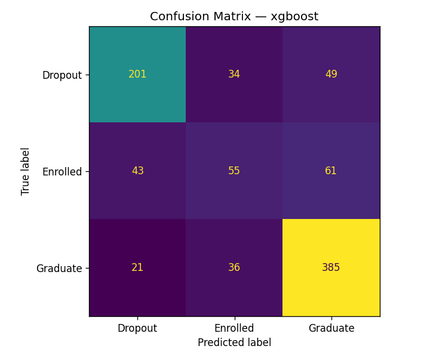
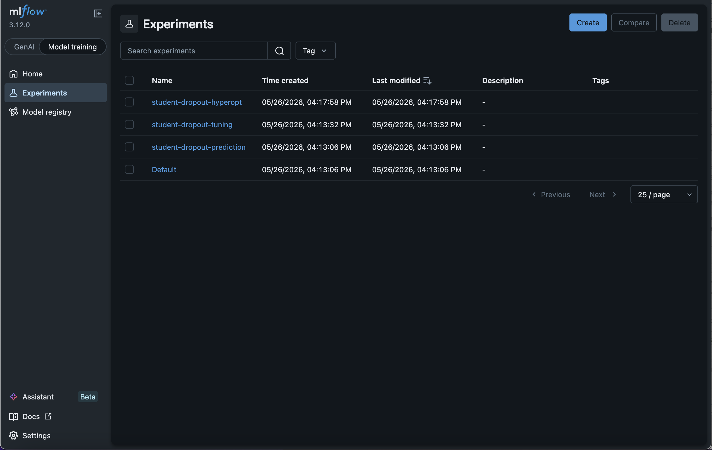
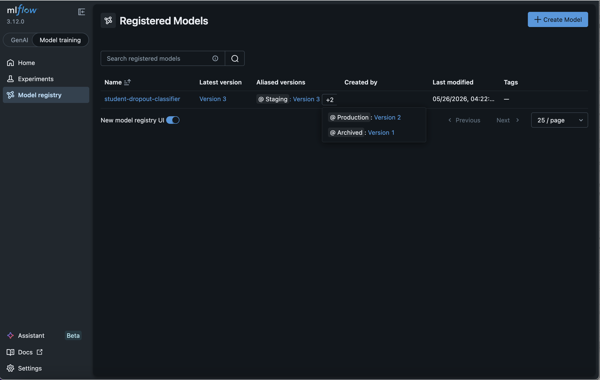
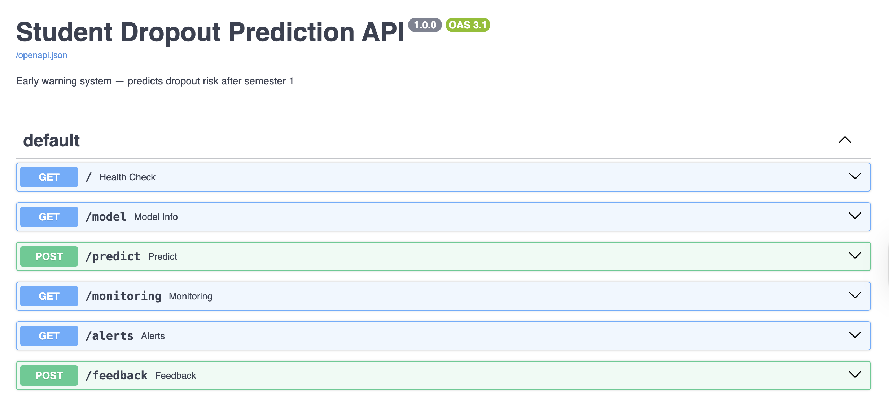
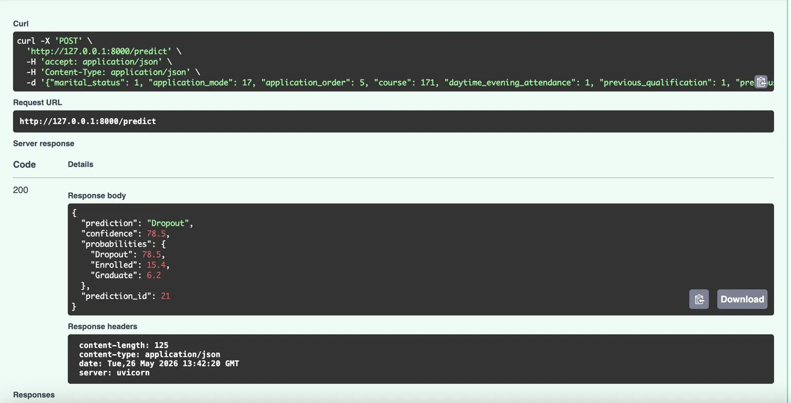
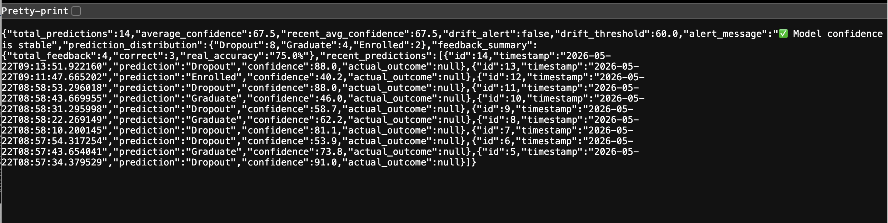

# Student Dropout — Early Warning Model

A machine learning pipeline that predicts whether a student will **drop out**, remain **enrolled**, or **graduate**, using only **semester 1** data. The project uses [MLflow](https://mlflow.org/) for experiment tracking and model registry, plus a **FastAPI** REST API with production-style monitoring: SQLite logging, drift alerts, and a feedback loop for real-world accuracy tracking.

**Target classes:** `Dropout`, `Enrolled`, `Graduate`

## Key features

- **Early-warning prediction** — semester 1 features only (no 2nd-semester leakage)
- **MLflow** — experiment tracking, artifact logging, Model Registry with `Production` / `Archived` aliases
- **Hyperparameter tuning** — grid search (45 runs) and Hyperopt Bayesian optimization (40 runs)
- **FastAPI REST API** — predict, monitor, alert, and collect feedback
- **SQLite monitoring** — every prediction logged with confidence and class probabilities
- **Drift alerts** — automatic warnings when rolling average confidence drops below 60%
- **Feedback loop** — submit actual outcomes to measure real prediction accuracy in production
- **Swagger UI** — interactive API docs at `/docs`

## Dataset

- **Source:** [UCI Student Dropout and Academic Success](https://archive.ics.uci.edu/dataset/697/predict+students+dropout+and+academic+success) (4,424 students)
- **File:** `data/students.csv` (semicolon-separated)
- **Design choice:** All **2nd-semester curricular unit** columns are dropped so the model only uses information available after semester 1.

## Architecture

```
data/students.csv
       │
       ▼
  preprocess.py  ──►  data/processed/  (arrays + preprocessor.pkl)
       │
       ├──► train.py          ──► MLflow: student-dropout-prediction
       │                           (Logistic Regression, Random Forest, XGBoost)
       │
       ├──► tune.py           ──► MLflow: student-dropout-tuning
       │                           (grid search RF + XGBoost → 45 runs)
       │
       └──► hyperopt_tune.py  ──► MLflow: student-dropout-hyperopt
                                   (Bayesian search RF + XGBoost → 40 runs)
       │
       ▼
  Model Registry: student-dropout-classifier
       │
       ├── set_stage.py   (v2 → Production, v3 → Staging, v1 → Archived)
       ├── predict.py     (CLI examples)
       └── serve_model.py (FastAPI :8000)
                │
                └── monitoring.py ──► data/monitoring.db
                      ├── predictions  (inputs, outputs, feedback)
                      └── alerts       (confidence drift warnings)
```

## Project structure

```
student-dropout-mlflow/
├── data/
│   ├── students.csv              # Raw dataset
│   ├── processed/                # Preprocessed train/test + pickles
│   └── monitoring.db             # SQLite: predictions + alerts
├── src/
│   ├── preprocess.py             # Feature engineering & train/test split
│   ├── train.py                  # Train 3 baselines, register best (v1)
│   ├── tune.py                   # Hyperparameter grid search, register best (v2)
│   ├── hyperopt_tune.py          # Bayesian optimization with Hyperopt, register best (v3)
│   ├── set_stage.py              # Production / Staging / Archived aliases
│   ├── predict.py                # CLI predictions from Production model
│   ├── serve_model.py            # FastAPI REST API
│   └── monitoring.py             # Logging, drift alerts, feedback, stats
├── docs/screenshots/             # README screenshots
├── mlruns/                       # MLflow tracking & model registry
├── outputs/                      # Confusion matrix PNGs from training
└── requirements.txt
```

## Setup

```bash
cd student-dropout-mlflow

python -m venv .venv
source .venv/bin/activate   # Windows: .venv\Scripts\activate

pip install -r requirements.txt
```

Run all commands from the **project root** so relative paths (`data/`, `mlruns/`) resolve correctly.

## End-to-end workflow

### 1. Preprocess

```bash
python src/preprocess.py
```

- Fixes a hidden tab character in the `Daytime/evening attendance` column name
- Drops semester 2 features (early-warning constraint)
- Encodes target with `LabelEncoder` (alphabetical: Dropout=0, Enrolled=1, Graduate=2)
- Applies `ColumnTransformer`:
  - **Categorical** → `OneHotEncoder` (drop first)
  - **Numerical** → `StandardScaler`
  - **Binary** (0/1) → passthrough
- 80/20 stratified train/test split
- Saves `data/processed/X_train.npy`, `X_test.npy`, `y_train.npy`, `y_test.npy`, `preprocessor.pkl`, `label_encoder.pkl`

### 2. Train baseline models

```bash
python src/train.py
```

| Model | Notes |
|-------|--------|
| Logistic Regression | `class_weight="balanced"` |
| Random Forest | 200 trees, `max_depth=10`, balanced |
| XGBoost | No class balancing (noted for future fairness comparison) |

Each run logs parameters, accuracy, F1 (macro & weighted), confusion matrix, classification report, and the model artifact. The **best model by F1 macro** is registered as **version 1**.

### 3. Hyperparameter tuning

```bash
python src/tune.py
```

Grid search in experiment `student-dropout-tuning`:

- **Random Forest:** `n_estimators` × `max_depth` × `min_samples_split` (18 runs)
- **XGBoost:** `n_estimators` × `max_depth` × `learning_rate` (27 runs), with balanced `sample_weight`

Each run logs **5-fold CV F1 macro**. The overall best model (by test F1 macro) is registered as **version 2**.

### 3b. Bayesian optimization with Hyperopt

```bash
python src/hyperopt_tune.py
```

Uses **Hyperopt** with the **TPE (Tree-structured Parzen Estimator)** algorithm in experiment `student-dropout-hyperopt`:

- **Random Forest:** 20 evaluations — search over `n_estimators` (50–400), `max_depth` (4–20), `min_samples_split` (2–10)
- **XGBoost:** 20 evaluations — search over `n_estimators` (50–400), `max_depth` (3–10), `learning_rate` (0.01–0.3, log-uniform)

Unlike grid search, Hyperopt uses Bayesian optimization to intelligently explore the search space — it learns from previous evaluations to focus on promising regions. Each run logs **5-fold CV F1 macro**. The best model is registered as **version 3**.

### 4. Promote models in the registry

```bash
python src/set_stage.py
```

- **Version 2** → `Production` (best grid search model, F1=0.6796)
- **Version 3** → `Staging` (best Hyperopt model, F1=0.6781)
- **Version 1** → `Archived` (baseline from `train.py`)

`predict.py` and `serve_model.py` load: `models:/student-dropout-classifier@Production`

### 5. Explore experiments in the UI

```bash
mlflow ui
```

Open http://127.0.0.1:5000 to compare runs, metrics, and artifacts.

### 6. CLI predictions

```bash
python src/predict.py
```

Runs two example students (at-risk vs low-risk) and prints class probabilities.

### 7. Serve the REST API

```bash
uvicorn src.serve_model:app --reload
```

Open http://127.0.0.1:8000/docs for interactive testing.

## API reference

| Method | Path | Description |
|--------|------|-------------|
| `GET` | `/` | Health check |
| `GET` | `/model` | Model name, alias, target classes |
| `POST` | `/predict` | Predict dropout risk; returns `prediction_id` |
| `GET` | `/monitoring` | Live stats, drift alert, feedback accuracy |
| `GET` | `/alerts` | Confidence drift alert history |
| `POST` | `/feedback` | Submit actual outcome for a past prediction |
| — | `/docs` | Swagger UI |

### `POST /predict`

**Request** (snake_case field names):

```json
{
  "marital_status": 1,
  "application_mode": 17,
  "application_order": 5,
  "course": 171,
  "daytime_evening_attendance": 1,
  "previous_qualification": 1,
  "previous_qualification_grade": 122.0,
  "nacionality": 1,
  "mothers_qualification": 19,
  "fathers_qualification": 12,
  "mothers_occupation": 5,
  "fathers_occupation": 9,
  "admission_grade": 127.3,
  "displaced": 1,
  "educational_special_needs": 0,
  "debtor": 1,
  "tuition_fees_up_to_date": 0,
  "gender": 1,
  "scholarship_holder": 0,
  "age_at_enrollment": 30,
  "international": 0,
  "curricular_units_1st_sem_credited": 0,
  "curricular_units_1st_sem_enrolled": 6,
  "curricular_units_1st_sem_evaluations": 6,
  "curricular_units_1st_sem_approved": 2,
  "curricular_units_1st_sem_grade": 8.5,
  "curricular_units_1st_sem_without_eval": 0,
  "unemployment_rate": 10.8,
  "inflation_rate": 1.4,
  "gdp": 1.74
}
```

**Response:**

```json
{
  "prediction": "Dropout",
  "confidence": 72.3,
  "probabilities": {
    "Dropout": 72.3,
    "Enrolled": 18.1,
    "Graduate": 9.6
  },
  "prediction_id": 1
}
```

Use `prediction_id` when submitting feedback later.

### `POST /feedback`

Submit the **actual outcome** once it is known (e.g. end of semester).

```json
{
  "prediction_id": 1,
  "actual_outcome": "Dropout"
}
```

Valid values: `"Dropout"`, `"Enrolled"`, `"Graduate"`.

**Response:**

```json
{
  "prediction_id": 1,
  "predicted": "Dropout",
  "actual_outcome": "Dropout",
  "correct": true,
  "message": "✅ Correct prediction"
}
```

Each prediction accepts feedback **once**. Duplicate submissions return an error response.

### `GET /monitoring`

Returns live production stats:

```json
{
  "total_predictions": 12,
  "average_confidence": 71.4,
  "recent_avg_confidence": 68.2,
  "drift_alert": true,
  "drift_threshold": 60.0,
  "alert_message": "⚠️  Average confidence dropped to 58.1% (threshold: 60.0%)",
  "prediction_distribution": { "Dropout": 5, "Graduate": 4, "Enrolled": 3 },
  "feedback_summary": {
    "total_feedback": 4,
    "correct": 3,
    "real_accuracy": "75.0%"
  },
  "recent_predictions": [
    {
      "id": 12,
      "timestamp": "2026-05-18T14:22:01",
      "prediction": "Dropout",
      "confidence": 72.3,
      "actual_outcome": null
    }
  ]
}
```

### `GET /alerts`

Returns drift alerts logged when rolling average confidence (last 20 predictions) drops below **60%**:

```json
{
  "total_alerts": 2,
  "alerts": [
    {
      "timestamp": "2026-05-18T14:22:01",
      "alert_type": "confidence_drift",
      "message": "Average confidence dropped to 58.1% — below threshold of 60.0%",
      "severity": "warning"
    }
  ],
  "status": "⚠️  Active alerts found"
}
```

Optional query param: `?limit=20` (default 20).

## Monitoring system

`monitoring.py` backs all production observability. On each `POST /predict`:

1. Input features and prediction result are saved to the `predictions` table
2. A unique `prediction_id` is returned to the client
3. Rolling average confidence (last 20 predictions) is checked
4. If below **60%**, a `confidence_drift` alert is written to the `alerts` table

### Database schema (`data/monitoring.db`)

**`predictions`**

| Column | Description |
|--------|-------------|
| `id` | Auto-increment prediction ID |
| `timestamp` | UTC ISO timestamp |
| `input_data` | JSON of request features |
| `prediction` | Predicted class |
| `confidence` | Max class probability (%) |
| `prob_dropout` / `prob_enrolled` / `prob_graduate` | Per-class probabilities |
| `actual_outcome` | Ground truth (set via `/feedback`) |

**`alerts`**

| Column | Description |
|--------|-------------|
| `timestamp` | When the alert fired |
| `alert_type` | e.g. `confidence_drift` |
| `message` | Human-readable description |
| `severity` | e.g. `warning` |

### Typical production flow

```
POST /predict  →  get prediction_id
       │
       ▼  (later, when outcome known)
POST /feedback  →  update actual_outcome, compute correctness
       │
       ▼
GET /monitoring  →  real_accuracy from feedback_summary
GET /alerts      →  review drift warnings
```

## Final results

All metrics are on the **held-out test set** (20% stratified split, 885 students). Models are ranked by **F1 macro** (primary metric for imbalanced classes).
F1 macro was used as the primary selection metric because the dataset is imbalanced across the three target classes.
### Baseline models (`train.py`)

| Model | Accuracy | F1 Macro | F1 Weighted | Registry |
|-------|----------|----------|-------------|----------|
| Random Forest | 72.09% | **66.67%** | 72.50% | v1 (Archived) |
| Logistic Regression | 69.60% | 65.45% | 70.89% | — |
| XGBoost | 72.43% | 64.71% | 71.50% | — |

### Grid search tuned models (`tune.py`) — top 3 of 45 runs

| Model | Hyperparameters | Accuracy | F1 Macro | CV F1 Macro | Registry |
|-------|-----------------|----------|----------|-------------|----------|
| **Random Forest** | `n_estimators=300`, `max_depth=10`, `min_samples_split=2` | **72.88%** | **67.96%** | 68.07% | **v2 (Production)** |
| XGBoost | `n_estimators=200`, `max_depth=6`, `learning_rate=0.05` | 71.98% | 67.83% | 67.63% | — |
| XGBoost | `n_estimators=100`, `max_depth=6`, `learning_rate=0.2` | 72.09% | 67.46% | 67.46% | — |

### Hyperopt Bayesian optimization (`hyperopt_tune.py`) — 40 runs

| Model | Search space | Evaluations | Registry |
|-------|-------------|-------------|----------|
| Random Forest | `n_estimators` 50–400, `max_depth` 4–20, `min_samples_split` 2–10 | 20 | — |
| XGBoost | `n_estimators` 50–400, `max_depth` 3–10, `learning_rate` 0.01–0.3 | 20 | — |

Best Hyperopt model (F1 macro = 0.6781) is registered as **v3 (Staging)**.

### Production model summary

| | |
|---|---|
| **Deployed model** | Grid search tuned Random Forest |
| **Registry** | `student-dropout-classifier` v2 → `@Production` |
| **Test F1 macro** | 67.96% (+1.29 pp vs baseline RF) |
| **Test accuracy** | 72.88% (+0.79 pp vs baseline RF) |
| **5-fold CV F1 macro** | 68.07% |

### Tuning method comparison

| Method | Approach | Total runs | Best F1 Macro | Registry |
|--------|----------|------------|---------------|----------|
| Grid search (`tune.py`) | Exhaustive sweep over fixed param combos | 45 | **67.96%** | v2 → Production |
| Hyperopt (`hyperopt_tune.py`) | Bayesian (TPE) — learns from previous evals | 40 | 67.81% | v3 → Staging |

## Screenshots

### Confusion matrices (baseline training)

Generated by `train.py` and saved to `outputs/` and `docs/screenshots/`.

| Logistic Regression | Random Forest | XGBoost |
|---------------------|---------------|---------|
|  |  |  |

### MLflow experiment tracking

| Experiments comparison | Model Registry |
|------------------------|----------------|
|  |  |

### FastAPI prediction API

| Swagger UI | Sample prediction |
|------------|-------------------|
|  |  |

### Live monitoring

`GET /monitoring` after predictions and feedback submissions.



## MLflow details

| Item | Value |
|------|--------|
| Tracking URI | `sqlite:///mlflow.db` |
| Experiments | `student-dropout-prediction`, `student-dropout-tuning`, `student-dropout-hyperopt` |
| Registered model | `student-dropout-classifier` |
| Production alias | Version 2 (grid search tuned Random Forest) |
| Staging alias | Version 3 (Hyperopt best model) |
| Archived alias | Version 1 (baseline Random Forest) |
| Selection metric | F1 macro (test set) |

## Dependencies

**`requirements.txt`:**

- `pandas`, `numpy`, `scikit-learn`, `xgboost`, `mlflow`, `matplotlib`, `jupyter`, `openpyxl`
- `hyperopt` (Bayesian hyperparameter optimization)
- `fastapi`, `uvicorn`, `pydantic` (REST API)

## Notes

- **Early warning only:** Do not include semester 2 features at inference time; the preprocessor and training pipeline exclude them by design.
- **Class imbalance:** Logistic Regression and Random Forest use balanced weights; XGBoost tuning uses `sample_weight`. Compare fairness vs performance before production use.
- **Test vs production accuracy:** Offline test metrics (F1 macro ~68%) differ from `real_accuracy` in `/monitoring`, which is computed only from predictions with submitted feedback.
- **MLflow SQLite backend:** The project uses `sqlite:///mlflow.db` as the tracking URI. Model artifacts are still stored in the local `mlruns/` directory.

## License

Dataset: see [UCI ML Repository](https://archive.ics.uci.edu/dataset/697/predict+students+dropout+and+academic+success) for citation and terms.
